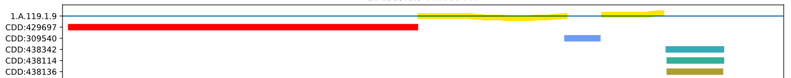
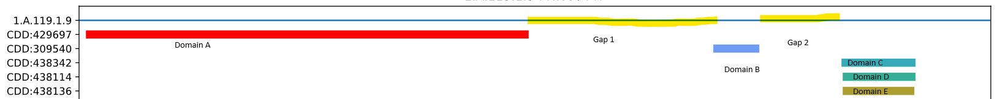

### Gap Identification

\
\
\
\
\
\
\
\
\
\
\
\
\
\
\
\
\
\
\
\
\
\
\
 

### Reference Domains

**Gap 1 Names:**
**(A, B)**

**Gap 2 Names:**
**(B, C)
(B, D)
(B, E)**

\
\
\
\
\
\
\
\
\
 

### Comparison Logic

**Set Gap-X:**
**{(B, C),(B, D),(B, E)}**

**Set Gap-Y:**
**{(A, B), (B, C),(C, D), (E, F)}**

**Set Difference: {(B, C)}**

 
 
 

**Set Gap-X':**
**{(B, C),(B, D),(B, E)}**

**Set Gap-Y':**
**{(A, B),(C, D), (E, F)}**

**Set Difference: $\emptyset$**

### Results

### Potential Complications

**Set Gap-X:**
**{(B, C),(B, D),(B, E)}**

**Set Gap-Y:**
**{(B, C),(B, F)}**

**Set Gap-Z:**
**{(B, F)}**

**Set Difference X-Y: {(B, C)}**
**Set Difference Y-Z: {(A, B)}**
**Problem - Gap X, Y, Z are in same group, considered "the same"**